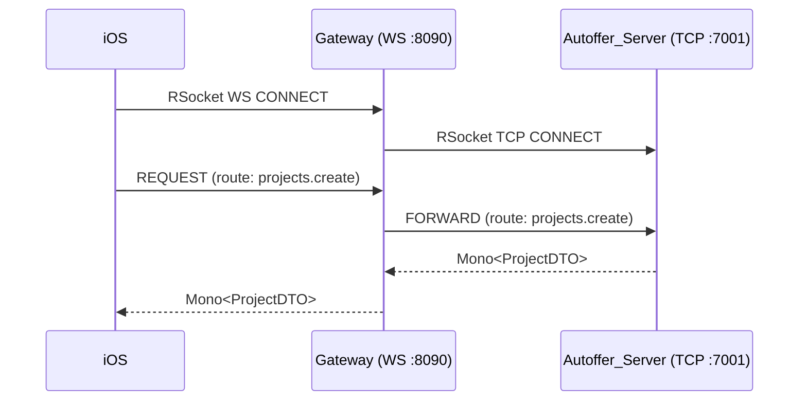

# Autoffer — Full Platform README

> **Autoffer** is a reactive, cloud-native platform that digitizes BOQ parsing, quoting, and real-time collaboration for the aluminum construction industry. It shortens quoting from **hours/days** to **minutes/seconds** via automated document parsing (DocAI), project lifecycle management, and an RSocket-based chat and workflow engine.

---

## 📋 Table of Contents

- [System Overview](#-system-overview)
- [Technologies](#️-technologies)
- [Network & Ports](#-network--ports-dev)
- [Backend — Autoffer Server](#-backend--autoffer-server)
- [iOS Application](#-ios-application)
- [Android Application](#-android-application)
- [Shared Data Models](#️-shared-data-models-dtos)
- [RSocket Endpoints](#-rsocket-endpoints)
- [PDF Generation](#-pdf-generation)
- [Persistence](#️-persistence-mongodb-atlas)
- [Deployment](#-deployment-gcp-cloud-run)
- [Dev Runbook](#-dev-runbook)
- [Configuration](#-configuration)
- [Efficiency Gains](#️-efficiency-gains)
- [Team](#-team)
- [License](#-license)

---

## 🧭 System Overview

| Service | Description |
|---|---|
| **Autoffer_Server** | Core service: projects, chat, users, ads, BOQ/Quote PDFs |
| **Gateway** | Bridges iOS (WebSocket) ⇄ Server (TCP) for `rsocket-swift` compatibility |
| **DocAI (FastAPI)** | Parses BOQ PDFs via Google Document AI and returns structured JSON |
| **Window-Measurement** | Support microservice for measurements (HTTP/JSON, `/health`) |
| **Android App** | Native Android client with modular SDK architecture |
| **iOS App** | Native iOS client (UIKit, Swift) with Firebase integration |

---

## ⚙️ Technologies

### Backend
- **Kotlin + Spring Boot 3.2.x** with **WebFlux** (reactive)
- **RSocket** (TCP & WebSocket), payloads as **JSON**
- **Mono** & **Flux** — Project Reactor types
- **MongoDB Atlas** (reactive repositories)
- **Python FastAPI** for DocAI microservice; integrates with **GCP Document AI**
- **PDF generation** for BOQ & Quote (server-side)
- **GCP Cloud Run** + **Artifact Registry** for deployments (Docker images)

### Android
- **Java** (SDK modules) communicating via RSocket or HTTP
- **RSocket over WebSocket** for real-time chat/workflows
- **HTTP REST** for microservices (Window-Measurement, DocAI)
- **Room DB** (`localProjectSDK`) for offline project creation

### iOS
- **Swift** (UIKit & programmatic UI, with some Storyboard usage in earlier stages)
- **Minimum iOS Support:** iOS 16+
- **Firebase** — Authentication, Firestore, and Storage
- **RSocket over WebSocket** via Gateway microservice
- **Swift Packages** for modular SDK approach
- **Lottie** animations for splash/transitions
- Dark Mode and Light Mode support

---

## 🔌 Network & Ports (Dev)

| Service | Protocol | Port |
|---|---|---|
| Autoffer_Server (HTTP) | Netty | `:8080` |
| Autoffer_Server (RSocket) | TCP | `:7001` |
| Gateway (iOS bridge) | RSocket over WebSocket | `:8090` (`ws://…/rsocket`) |
| DocAI (FastAPI) | HTTP | `:5051` |
| Window-Measurement | HTTP | `:8001` (`/health`) |

---

## 🖥 Backend — Autoffer Server

> **Repo layout note:** the core backend folder is named **`Autoffer_Server`** (formerly `messaging-server`).

### iOS Gateway Bridge

iOS connects via RSocket over WebSocket and cannot connect directly to the Kotlin RSocket server. The Gateway bridges this connection:



---

## 📱 iOS Application

### Overview
The iOS app supports project management, chat functionality, and BOQ/Quote workflows for private customers, architects, and factories. It mirrors the Android business logic while adapting to iOS platform conventions.

### Key Differences from Android

| Aspect | Android | iOS |
|---|---|---|
| UI Framework | Material Design Components | UIKit + programmatic layouts |
| Navigation | Fragments | `UITabBarController` + `UINavigationController` |
| RSocket Connection | Direct TCP | Via Gateway (WebSocket bridge) |
| Auth | Server (MongoDB) | Firebase Authentication |
| Storage | Firebase / Server | Firebase Firestore & Storage |
| Animations | — | Lottie |

### Current Status
> ⚠️ The iOS application is **still under development** and is **not yet production-ready**. Some features are partially implemented and full backend integration is in progress.

### Features (in progress)
- User authentication (sign up, login, password reset)
- Project creation with manual entry or photo-based measurement
- Chat system with file sharing (BOQ/Quote PDFs)
- Factory and architect directory with contact and chat options
- Quote generation and status updates between customers and factories

---

## 🤖 Android Application

### Architecture
- **Fragments-based navigation** inside `MainActivity`
- **Reactive networking** via RSocket over WebSocket
- **HTTP/REST** for microservices (`/measure`, `/autoQuote`)
- **Local Room DB** for offline project creation

### App Screens & UX Flow

| Screen / Fragment | Purpose |
|---|---|
| **Splash / Launch** | Displays Autoffer logo briefly before navigation starts |
| **Login Fragment** | User login with email & password |
| **Register Fragment** | Full registration (name, email, password, phone, address, profile type) |
| **Forgot Password Fragment** | Password reset via backend |
| **MainActivity (Host)** | Hosts the navigation graph and all Fragments |
| **New Project Fragment** | Start a new project (manual entry or image capture) |
| **Add Manual Fragment** | Enter width/height, select profile/glass, define quantity & position |
| **Image Capture / Picker** | Capture/pick photo, processed by Window-Measurement microservice |
| **Current Project Fragment** | Displays all locally added items; shows cost indicators ($/$$) |
| **My Projects Fragment** | Displays all saved projects (adaptive layout per user type) |
| **Edit Project Fragment** | Edit quantity and position of items only |
| **User Directory Fragment** | Lists factories/architects; includes "Contact Info" and "Open Chat" |
| **Chat Activity** | Real-time RSocket chat; supports text, BOQ/Quote messages, file transfers |
| **Pdf View Activity** | Opens and displays BOQ or Quote PDFs |
| **Factory View (in Adapter)** | Factory mode in MyProjects: send Quotes, show status, confirm offers |

---

## 👥 User Roles

| Role | Description |
|---|---|
| **Private Customer** | Create projects quickly, send BOQ PDFs, compare multiple factory quotes |
| **Factory** | Receive BOQ PDFs, generate Quote PDFs, communicate with clients |
| **Architect** *(Future)* | Profile creation available now; templates, CAD/BIM integration planned |

---

## 🧩 SDK Modules (Android & iOS)

Both platforms follow a **modular SDK architecture** — each domain is a separate module/package:

| SDK | Responsibility |
|---|---|
| `chatSDK` | Messaging, BOQ/Quote messages, file sharing |
| `projectsSDK` | Project creation, saving, BOQ/Quote PDFs |
| `usersSDK` | User management and sessions |
| `rsocketSDK` | RSocket networking client |
| `localProjectSDK` | Local Room storage for unsaved projects (Android) |
| `pricingSDK` | Lightweight cost indicators ($/$$) |
| `adsSDK` | Advertisement models and requests |
| `coremodelsSDK` | Shared DTOs across modules |

### Example Usage (Android Java)

```java
// Chat
Message msg = new Message(chatId, senderId, receiverId, "Hello", "TEXT");
Message sent = messageManager.sendMessage(msg);

// Projects
CreateProjectRequest req = new CreateProjectRequest(clientId, "123 Main St", items, factoryIds);
ProjectDTO project = projectManager.createProject(req);

// Users
User currentUser = userManager.getCurrentUser();
String profileType = currentUser.getProfileType(); // PRIVATE_CUSTOMER / FACTORY / ARCHITECT

// RSocket
ProjectDTO response = rSocketClient.requestResponse("projects.create", req, ProjectDTO.class);

// Local storage
localDao.insert(new LocalItemEntity(profileId, glassId, width, height, quantity, position));
```

---

## 🗃️ Shared Data Models (DTOs)

### CreateProjectRequest

**Kotlin (Server)**
```kotlin
data class CreateProjectRequest(
    val clientId: String,
    val projectAddress: String,
    val items: List<ItemModelDTO>,
    val factoryIds: List<String>
)
```

**Swift (iOS)**
```swift
public struct CreateProjectRequest: Codable, Hashable {
    public var clientId: String
    public var projectAddress: String
    public var items: [ItemModelDTO]
    public var factoryIds: [String]
}
```

### AutoQuoteFromPdfRequest

```kotlin
data class AutoQuoteFromPdfRequest(
    val projectId: String,
    val factoryId: String,
    val factor: Double? = null,
    val includeRaw: Boolean? = null,
    val skipUnparseable: Boolean? = null,
    val filename: String? = "boq.pdf",
    val pdfBytes: ByteArray // serialized as Base64 in JSON over RSocket
)
```

### Quote Status Update

```kotlin
data class UpdateFactoryStatusRequest(
    val projectId: String,
    val factoryId: String,
    val newStatus: QuoteStatus
)

enum class QuoteStatus { PENDING, RECEIVED, ACCEPTED, REJECTED }
```

---

## 🔄 RSocket Endpoints

### Ping — Request/Response

```kotlin
@MessageMapping("ping")
fun ping(): Mono<String> = Mono.just("pong from Autoffer_Server")
```

```bash
rsc --request --route=ping --data "{}" tcp://localhost:7001
```

### Create Project — Request/Response

```kotlin
@MessageMapping("projects.create")
fun createProject(req: CreateProjectRequest): Mono<ProjectDTO> =
    projectService.create(req)
```

**Sample Payload**
```json
{
  "clientId": "cust-001",
  "projectAddress": "123 Main St",
  "items": [
    { "profileId": "5500", "glassType": "Triplex", "width": 200, "height": 150, "quantity": 2 }
  ],
  "factoryIds": ["fact-001", "fact-002"]
}
```

### Chat Stream — Request/Stream

```kotlin
@MessageMapping("chat.stream")
fun chatStream(chatId: String): Flux<MessageDTO> =
    messageService.stream(chatId)
```

**Android Client Example**
```java
rsocketClient.requestStream(DefaultPayload.create("{\"chatId\":\"123\"}"))
    .map(p -> mapper.readValue(p.getDataUtf8(), MessageDTO.class))
    .doOnNext(adapter::addMessage)
    .subscribe();
```

### Send File in Chat — Request/Response

```kotlin
@MessageMapping("chat.sendfile")
fun sendFile(req: FileMessageRequest): Mono<MessageDTO> =
    chatService.sendFileMessage(req)
```

**Sample Payload**
```json
{
  "chatId": "123",
  "senderId": "user-1",
  "receiverId": "factory-1",
  "filename": "boq.pdf",
  "fileBytes": "BASE64_STRING"
}
```

### Auto Quote (DocAI) — Request/Response

```kotlin
@MessageMapping("projects.autoQuote.parse")
fun autoQuote(req: AutoQuoteFromPdfRequest): Mono<QuoteModelDTO> =
    docAiClient.parseBoq(req)
```

**FastAPI (DocAI) Sketch**
```python
from fastapi import FastAPI
from pydantic import BaseModel

app = FastAPI()

class AutoQuoteRequest(BaseModel):
    projectId: str
    factoryId: str
    factor: float | None = None
    filename: str | None = "boq.pdf"
    pdfBytes: bytes

@app.post("/parse")
async def parse_boq(req: AutoQuoteRequest):
    items = await parse_with_gcp(req.pdfBytes)
    return {"factoryId": req.factoryId, "projectId": req.projectId, "items": items}
```

---

## 📄 PDF Generation

- **BOQ PDF** (auto-generated on project creation): RTL tables, width/height columns, creation date, pagination.
- **Quote PDF** (factory-branded): Factory logo, items with prices, Subtotal/VAT/Total, default notes (1–9), signature blocks.

---

## 📷 Window-Measurement Microservice

Users can **take a photo of an empty wall opening or an existing aluminum window**. The service extracts accurate dimensions automatically. Based on these, the app suggests suitable aluminum profiles and glass types. Manual entry (width & height) is also fully supported.

---

## 🗄️ Persistence (MongoDB Atlas)

Reactive repositories; project docs include:
- `factoryIds: List<String>`
- `quoteStatuses: Map<factoryId, QuoteStatus>`
- `boqPdf` embedded (quotes mapped by factoryId, planned/partial)

---

## 🚢 Deployment (GCP Cloud Run)

```bash
# Build & push image
docker build -t europe-west1-docker.pkg.dev/<PROJECT_ID>/autoffer/autoffer-server:latest ./Autoffer_Server
docker push europe-west1-docker.pkg.dev/<PROJECT_ID>/autoffer/autoffer-server:latest

# Deploy
gcloud run deploy autoffer-server \
  --image europe-west1-docker.pkg.dev/<PROJECT_ID>/autoffer/autoffer-server:latest \
  --region europe-west1 \
  --platform managed
```

Configure Gateway and DocAI as separate Cloud Run services with their own images.

---

## 🚀 Dev Runbook

```bash
# Start all dev services
bash scripts/start-dev.sh

# Stop all
bash scripts/stop-dev.sh

# If 8080 is occupied
lsof -i :8080
kill -9 <PID>

# Check all ports
lsof -i :8080
lsof -i :8090
lsof -i :7001
lsof -i :5051
lsof -i :8001

# Run DocAI microservice
uvicorn app:app --host 0.0.0.0 --port 5051 --reload
```

---

## 🔧 Configuration

### `application-dev.yml` (Autoffer_Server)

```yaml
server:
  port: 8080

spring:
  application:
    name: Autoffer_Server
  data:
    mongodb:
      uri: mongodb+srv://<USER>:<PASSWORD>@cluster0.mongodb.net/autoffer?retryWrites=true&w=majority
  rsocket:
    server:
      transport: tcp
      port: 7001

logging:
  level:
    root: INFO
    org.springframework.rsocket: DEBUG

gateway:
  ws:
    port: 8090

docai:
  url: http://localhost:5051/parse

measurement:
  healthUrl: http://localhost:8001/health
```

### Minimal Gateway `application.yml`

```yaml
server:
  port: 8090

autoffer:
  rsocket:
    server:
      host: localhost
      port: 7001
```

### Environment Variables

```bash
export SPRING_PROFILES_ACTIVE=dev
export MONGODB_URI="mongodb+srv://<USER>:<PASSWORD>@cluster0.mongodb.net/autoffer"
export DOCAI_URL="http://localhost:5051/parse"
```

---

## ⏱️ Efficiency Gains

| Method | Per Item | Per 13-item BOQ |
|---|---|---|
| Legacy desktop (manual) | 2–5 min | ~1 hour |
| Autoffer manual entry | ~15 sec | ~3 min |
| Autoffer DocAI parsing | ~1 sec/page | Seconds |

---

## 👥 Team

- **Roei Hakmon** — Project Lead & Developer

---

## 📜 License

Proprietary © Autoffer. All rights reserved.
